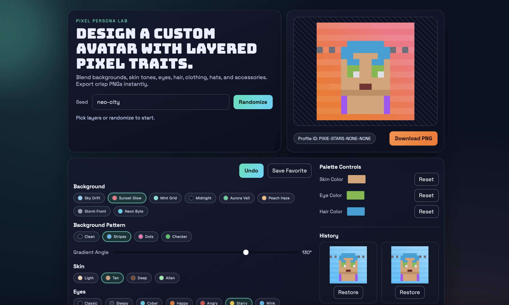

# Personalized Pixel Avatar

A full-stack monorepo for generating customizable pixel avatars.

## Screenshot


## Tech
- React + TypeScript + Vite frontend
- Node.js + TypeScript + Express API
- Shared avatar engine package for deterministic layer-based rendering

## Structure
- `apps/web` - avatar editor UI and gallery
- `apps/api` - randomization and PNG rendering API
- `packages/shared-types` - shared TypeScript contracts
- `packages/avatar-engine` - layer system, validation, randomization, pixel composer

## Features
- Layered editor with background, skin, eyes, hair, eyebrows, mouth, facial hair, clothing, hats, and accessories.
- Background patterns (stripes, dots, checker) and adjustable gradient angle.
- Palette controls for skin, eyes, and hair colors (with reset to presets).
- Deterministic randomization via seed.
- Undo history and favorites tray.
- PNG export (client triggers API rendering for crisp scaling).

## Quick Start
1. Install dependencies
```bash
npm install
```
2. Run API + web app
```bash
npm run build:packages
npm run dev
```
3. Open web app at `http://localhost:5173`

## Backend Only
Run just the API on port 8080:
```bash
npm run dev:api
```

## API
- `GET /health`
- `POST /api/avatar/random` (optional `{ "seed": "my-seed" }`)
- `POST /api/avatar/render` with body:
```json
{
  "config": {
    "background": "sunset",
    "skin": "tan",
    "eyes": "cyber",
    "hair": "mohawk",
    "accessory": "glasses"
  },
  "scale": 16
}
```

## Why this architecture
The layer system is its own reusable package (`@pixel/avatar-engine`) so your rendering rules are centralized and testable while both API and UI stay consistent.
